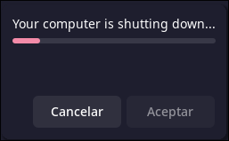

# AUTOSHUTDOWN

:star: Star me up!

How many times did you forget to shutdown your computer before going to sleep?
Maybe you just need to automatize this task for any reason.
Well, here it comes *AUTOSHUTDOWN*, a Rust program that allows you to schedule automatic shutdowns on your computer.

## Table of contents[](#table-of-contents)
- [AUTOSHUTDOWN](#autoshutdown)
  - [Table of contents](#table-of-contents)
  - [Installation](#installation)
    - [Binary](#binary)
    - [Build from source](#build-from-source)
  - [Usage](#usage)
    - [Cron](#cron)
    - [Options](#options)
      - [Enable](#enable)
      - [Disable](#disable)
      - [Status](#status)
      - [Help](#help)
  - [COMPLETIONS](#completions)

## Installation

### Binary

```sh
curl -sL $(curl -s https://api.github.com/repos/alvaro17f/autoshutdown/releases/latest | grep browser_download_url | cut -d '"' -f 4) | sudo tar zxf - -C /usr/bin --overwrite
```
### Build from source
Requirements:
- [git](https://git-scm.com/)
- [rust](https://rust-lang.org/)

```sh
git clone https://github.com/alvaro17f/autoshutdown.git
cd autoshutdown
cargo build --release
sudo cp target/release/autoshutdown /usr/bin
```
## Usage
To use the program, simply run the following command:

```sh
autoshutdown
```
It will display a pop-up like this:



### Cron

```sh
PATH="/usr/local/bin:/usr/bin:/bin"

0 2 * * 1-5 autoshutdown
```
In this example we're setting our computer to shutdown from monday to friday at 2:00.
The upper *PATH* variable is indicating cron where is our binary.

Now that our cronjob is set, let's see how can I disable or enable autoshutdown.

### Options

#### Enable
**autoshutdown** is enabled by default.
Enabling autoshutdown, our computer will shutdown at the time we had specify in our cronjob:

```sh
autoshutdown enable
```
#### Disable
Let's say that we don't want our machine to shutdown:

```sh
autoshutdown disable
```

#### Status
How can I see if it's enabled or disabled?

```sh
autoshutdown status
```

#### Help
```sh
$ autoshutdown help

Usage: autoshutdown [OPTIONS] [COMMAND]

Commands:
  enable   Enable autoshutdown
  disable  Disable autoshutdown
  status   Show current status
  help     Print this message or the help of the given subcommand(s)

Options:
      --generate <GENERATOR>  [possible values: bash, elvish, fish, powershell, zsh]
  -h, --help                  Print help
  -V, --version               Print version
```

## COMPLETIONS

> if your shell is `bash` you'll also need the `bash-completion` package installed.

To get `<TAB>` completions run `autoshutdown --generate <your shell>`

